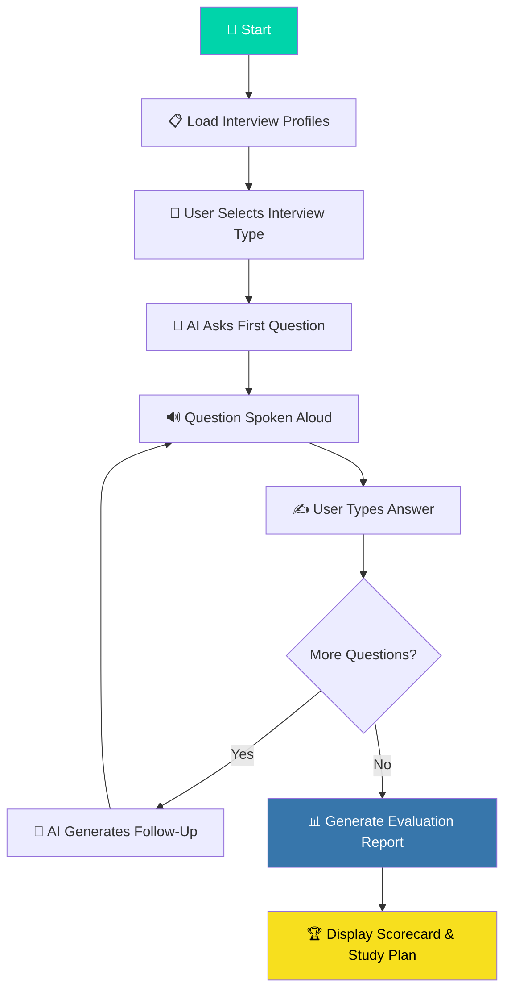

<div align="center">

# 🎯 AI Interview Coach

### *Your Personal AI-Powered Mock Interview Simulator*

[](https://python.org)
[](https://deepseek.com)
[](LICENSE)
[](CONTRIBUTING.md)

<br/>

> **Ace your next interview.** Practice with an AI interviewer that adapts, challenges, and evaluates you — just like the real thing. Complete with voice narration and detailed performance reports.

<br/>

```
  ╔══════════════════════════════════════════════════════╗
  ║            🎯  AI INTERVIEW COACH  🎯               ║
  ╠══════════════════════════════════════════════════════╣
  ║                                                      ║
  ║   1. 🏢  TCS Campus Placement                       ║
  ║   2. ⚛️   Senior React Developer                     ║
  ║   3. 🇮🇳  UPSC Personality Test                      ║
  ║   4. 🏦  SBI PO Interview                           ║
  ║                                                      ║
  ╚══════════════════════════════════════════════════════╝
```

</div>

---

## 🌟 Why AI Interview Coach?

Most candidates fail interviews **not because of lack of knowledge**, but because of lack of **practice under pressure**. AI Interview Coach simulates real interview environments with:

- 🧠 **Contextual follow-up questions** — the AI remembers your answers and digs deeper
- 🔊 **Voice narration** — hear questions spoken aloud, just like a real interview
- 📊 **Detailed scorecards** — get graded on 6–7 dimensions with actionable feedback
- 🎯 **Role-specific prompts** — every interview type has a unique, expertly-crafted system prompt
- 📋 **Personalized study plans** — receive a 15–30 day improvement roadmap after each session

---

## ✨ Features at a Glance

| Feature | Description |
|---|---|
| **🏢 TCS Campus Placement** | Freshers campus recruitment — HR, aptitude, behavioral & technical |
| **⚛️ Senior React Developer** | FAANG-level technical deep-dive — hooks, system design, TypeScript |
| **🇮🇳 UPSC Personality Test** | Civil Services interview board — current affairs, ethics, governance |
| **🏦 SBI PO Interview** | Banking PO panel — RBI policy, financial inclusion, digital banking |
| **🔊 Text-to-Speech** | Every question is spoken aloud using `pyttsx3` |
| **📊 Detailed Reports** | Dimension-wise scoring, verdict, and a structured improvement plan |
| **🔁 Smart Retry Logic** | Exponential backoff handles API rate limits gracefully |
| **⏹️ Graceful Exit** | Type `quit`, `exit`, or `stop` at any point to end early |

---

## 🏗️ Architecture

```
MockMate/
│
├── interview.py          # 🧠 Core application — interview engine & TTS
├── interviews.json       # 📝 Interview profiles & system prompts
├── .env                  # 🔐 API keys (not tracked in git)
├── .gitignore            # 🚫 Ignored files
└── README.md             # 📖 You are here
```

### How It Works



---

## 🚀 Quick Start

### Prerequisites

- **Python 3.8+**
- A **DeepSeek API key** → [Get one here](https://platform.deepseek.com/)

### 1️⃣ Clone the Repository

```bash
git clone https://github.com/sayan706/MockMate.git
cd MockMate
```

### 2️⃣ Install Dependencies

```bash
pip install openai pyttsx3 python-dotenv
```

### 3️⃣ Set Up Environment Variables

Create a `.env` file in the project root:

```env
DEEPSEEK_API_KEY=your_deepseek_api_key_here
```

### 4️⃣ Run the Interview Coach

```bash
python interview.py
```

---

## 🎮 Usage

Once launched, you'll see an interactive menu:

```
═══════════════════════════════════════════════════════
   🎯  AI INTERVIEW COACH  🎯
═══════════════════════════════════════════════════════

   Choose your interview type:

   1. 🏢  TCS Campus Placement
      └─ Tata Consultancy Services campus recruitment interview for freshers

   2. ⚛️   Senior React Developer
      └─ Senior React Developer technical interview at a top tech company

   3. 🇮🇳  UPSC Personality Test
      └─ Union Public Service Commission Civil Services personality test

   4. 🏦  SBI PO Interview
      └─ State Bank of India Probationary Officer interview

═══════════════════════════════════════════════════════
```

1. **Select** your interview type (1–4)
2. **Press Enter** to begin
3. **Answer** each question when prompted
4. The AI will **speak the question** and **adapt** based on your responses
5. After up to **10 questions**, receive a **detailed evaluation report**

> 💡 **Tip:** Type `quit`, `exit`, or `stop` at any prompt to end the interview early and still receive your report.

---

## 📊 Sample Evaluation Report

After each interview, you receive a comprehensive scorecard:

```
══════════════════════════════════════════════════════════════════════════
📊 FINAL REPORT — TCS Campus Placement
══════════════════════════════════════════════════════════════════════════

1. Overall Score:               72/100
2. Communication Score:         8/10
3. Technical Aptitude Score:    6/10
4. Confidence Score:            7/10
5. Problem Solving Score:       7/10
6. Cultural Fit Score:          8/10

🟢 Strengths:
   • Excellent communication and articulation
   • Strong awareness of company values

🔴 Weaknesses:
   • Gaps in DBMS normalization concepts
   • Needs deeper OS fundamentals

📈 Verdict: WAITLISTED

📅 15-Day Preparation Plan:
   Day 1-3: Revise DBMS (normalization, SQL queries, joins)
   Day 4-6: OS concepts (process management, memory, scheduling)
   ...
══════════════════════════════════════════════════════════════════════════
```

---

## 🔧 Configuration

### Changing the Number of Questions

In `interview.py`, modify the `MAX_QUESTIONS` constant:

```python
MAX_QUESTIONS = 10  # Change to any number you prefer
```

### Adjusting Speech Speed

The TTS speech rate can be tuned in the `speak()` function:

```python
engine.setProperty("rate", 170)  # Words per minute (default: 170)
```

### Adding Custom Interview Types

Add a new entry to `interviews.json`:

```json
{
    "id": 5,
    "name": "Your Custom Interview",
    "emoji": "🎯",
    "description": "A brief description of the interview type",
    "system_prompt": "Your detailed system prompt here..."
}
```

---

## 🛠️ Tech Stack

<div align="center">

| Technology | Purpose |
|:---:|:---:|
|  | Core runtime |
|  | LLM backbone |
|  | API client (compatible) |
|  | Text-to-Speech |
|  | Environment management |

</div>

---

## 🗺️ Roadmap

- [ ] 🌐 **Web UI** — Browser-based interface with real-time chat
- [ ] 🎤 **Voice Input** — Speech-to-text for hands-free answering
- [ ] 📁 **Session History** — Save and review past interview sessions
- [ ] 🧩 **Plugin System** — Community-contributed interview templates
- [ ] 📈 **Progress Tracking** — Track improvement across multiple sessions
- [ ] 🌍 **Multi-language Support** — Interviews in Hindi, Tamil, and more
- [ ] 🤝 **Peer Mode** — Two-player mock interview with AI moderation

---

## 🤝 Contributing

Contributions are welcome! Here's how to get started:

1. **Fork** the repository
2. **Create** your feature branch: `git checkout -b feature/amazing-feature`
3. **Commit** your changes: `git commit -m "Add amazing feature"`
4. **Push** to the branch: `git push origin feature/amazing-feature`
5. **Open** a Pull Request

---

## 📄 License

This project is licensed under the **MIT License** — see the [LICENSE](LICENSE) file for details.

---

## 🙏 Acknowledgments

- [**DeepSeek**](https://deepseek.com) — for the powerful DeepSeek-V3 language model
- [**pyttsx3**](https://github.com/nateshmbhat/pyttsx3) — for offline text-to-speech
- [**OpenAI Python SDK**](https://github.com/openai/openai-python) — for the compatible API client

---

<div align="center">

**Built with ❤️ for interview preparation**

⭐ **Star this repo** if it helped you prepare for your dream job!

<br/>

[](https://github.com/sayan706/MockMate)
[](https://github.com/sayan706/MockMate)

</div>
